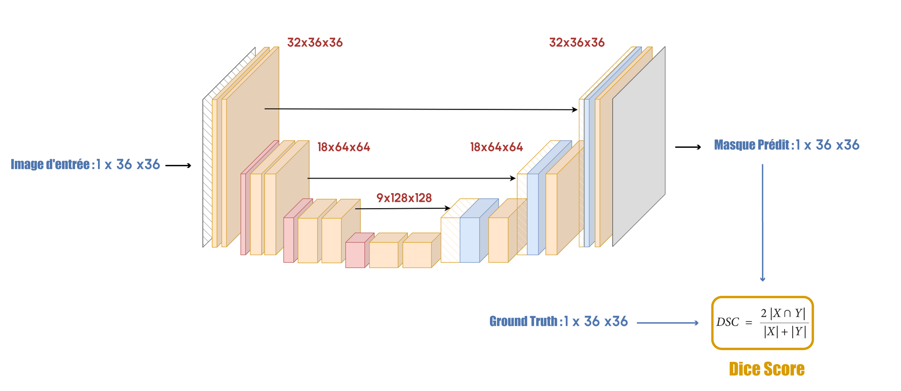

# Challenge-Data-CorroSeg

## Overview
This challenge, organized by ENS Ulm and Collège de France, aims to train a model for segmenting groove defects in provided patch images. The objective is to achieve the highest possible dice score using the provided data, which consists of patch images of groove defects and their corresponding masks sized at 36x36 pixels. Evaluation is based on the dice score, and only the provided data is allowed for model training. Our approach involves exploring three architectural designs: UNet, Attention UNet, and Residual UNet, each trained using various loss functions: Binary Cross-Entropy (BCE), Focal Loss, and Dice Loss.

## Example
Here is an example of the image and its corresponding ground truth mask:

  

## Results
The best results were achieved using the UNet architecture, with dice scores of 0.85% for training, 0.82% for validation, and 0.61% for testing.

UNet Architecture:

  

Results Plot:

  

## References
- **U-Net: Convolutional Networks for Biomedical Image Segmentation**  
  Olaf Ronneberger, Philipp Fischer, Thomas Brox  
  [Link to Paper](https://arxiv.org/abs/1505.04597)

- **ResUNet-a: A Deep Learning Framework for Semantic Segmentation of Remotely Sensed Data**  
  Foivos I. Diakogiannis, François Waldner, Peter Caccetta, Chen Wu  
  [Link to Paper](https://arxiv.org/abs/1904.00592)

- **Attention U-Net: Learning Where to Look for the Pancreas**  
  Ozan Oktay, Jo Schlemper, Loic Le Folgoc, Matthew Lee, Mattias Heinrich, Kazunari Misawa, Kensaku Mori, Steven McDonagh, Nils Y Hammerla, Bernhard Kainz, Ben Glocker, Daniel Rueckert  
  [Link to Paper](https://arxiv.org/abs/1804.03999)
